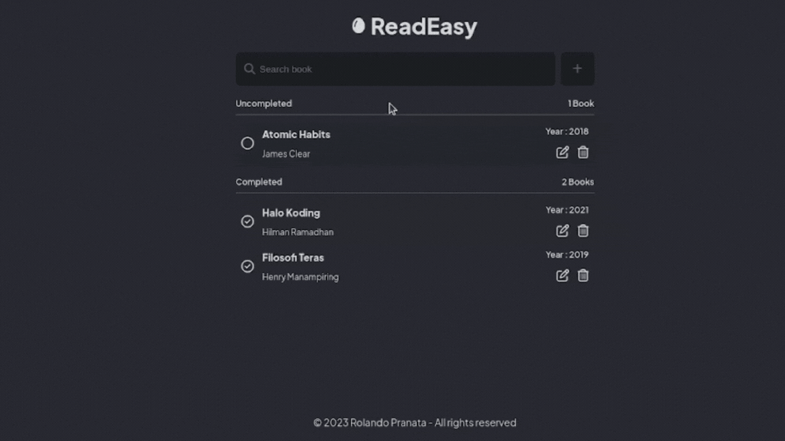

# [Read Easy - Belajar Membuat Front-End Web untuk Pemula - IDCamp Scholarship Submission Project 2023](https://www.dicoding.com/academies/315/corridor)

[](https://read-easy-idcamp.netlify.app/)

Welcome to the Read Easy project! This application is part of my submission for the IDCamp scholarship in 2023. Read Easy is a simple open managemzent application designed to help beginners create web frontends using only HTML and CSS. Whether you're new to web development or looking for a straightforward example project, Read Easy is here to assist you.

## Table of Contents

- [Introduction](#introduction)
- [Features](#features)
- [Getting Started](#getting-started)
- [Usage](#usage)
- [Contributing](#contributing)

## Introduction

Read Easy is a minimalistic web application that showcases the power of HTML and CSS for creating web frontends. It serves as an ideal starting point for beginners who want to learn the basics of web development or as a quick reference for those looking to brush up on their skills.

### Features

- Simple and clean user interface.
- Easy-to-understand HTML and CSS code.
- A straightforward example of creating a web page without any JavaScript.
- CRUD for managed your reading list book

## Getting Started

To get started with Read Easy, you can follow this step:

1. **Clone the Repository:** You can clone this GitHub repository to your local machine using the following command:

   ```shell
   git clone https://github.com/your-username/read-easy.git
   ```

2. **You can open html file from this project on your favorite browser like :**

- Chrome
- Mozilla Firefox
- etc...

3. **Use Live Server Extension in Visual Studio Code :**

- If you prefer an even easier way to run the project, you can install the Live Server extension in Visual Studio Code. Once installed, right-click the index.html file in the project folder and select "Open with Live Server." This will launch the application in your default web browser.

## Usage

Once you have the project up and running, you can explore the Read Easy application. Feel free to modify the HTML and CSS files to experiment and learn how changes affect the layout and design. Here are some tips for using the project:

- **HTML :** Open the index.html file in your code editor and make changes to the HTML structure to see how it impacts the web page's layout and content.

- **CSS :** Customize the styles by editing the style.css file. Experiment with different CSS properties and values to understand how they affect the appearance of the page.

- **Learn and Experiment :** Use this project as a learning resource. Try adding new elements, modifying styles, or implementing additional features using HTML and CSS.

## Contributing

Contributions to this project are welcome! If you'd like to contribute, follow these steps:

1. Fork the repository to your GitHub account.
2. Clone the forked repository to your local machine.
3. Create a new branch for your changes: git checkout -b feature/your-feature-name.
4. Make your changes, commit them, and push to your GitHub repository.
5. Open a pull request from your forked repository to the original repository.

Please ensure that your contributions align with the project's goals and maintain the simplicity of the application.

Thank you for checking out Read Easy! Happy learning and coding! If you have any questions or encounter any issues, feel free to open an issue on this repository.
